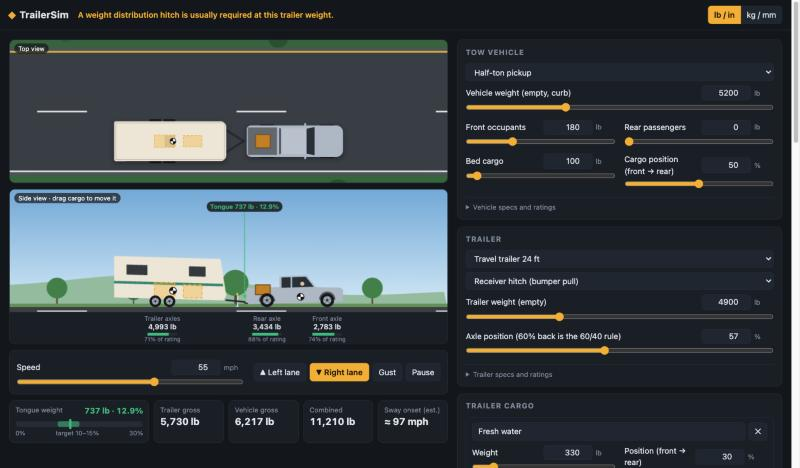
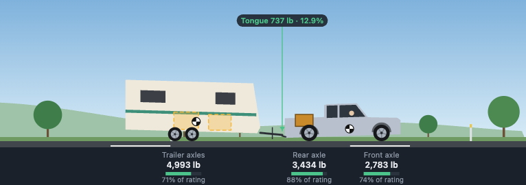

# TrailerSim

A trailer weight and balance calculator with a live driving simulation. Pick a tow vehicle and a trailer,
load them up, move the weight around, and watch the numbers and the rig respond in real time.



It runs entirely in the browser: one HTML page, plain CSS and JavaScript, no build step and no dependencies.

## Credit

The method and worked examples come from the Engineers Edge page
[Weight and Balance Equations and Calculator For Trailers](https://www.engineersedge.com/calculators/trailer-weight-balance.htm).
That page explains how to find a trailer's centre of balance from axle scale weights and distances:

> CB from the reference datum line = Σ(distance × weight) ÷ gross weight

TrailerSim applies that formula live, adds the tow-vehicle side of the problem, and draws the result.
The three calculation examples from the page are built into the worksheet at the bottom of the app.

## What it does

- **Live weight and balance.** Trailer centre of balance, tongue (or pin) weight and percentage, trailer axle
  load, tow-vehicle front and rear axle loads, gross and combined weights. Every input is a slider with a number box.
- **Checks against ratings.** Tongue weight target band (10–15% for ball hitches, 15–25% for gooseneck and
  fifth-wheel), tow rating, hitch tongue rating, GVWR and payload, each axle's GAWR, GCWR, trailer GVWR and
  trailer axle rating, plus warnings for front axle unloading and for when a weight distribution hitch is normally required.
- **Vehicles and trailers.** Presets from a mid-size sedan to a one-ton dually, and trailers from a 4×6
  Diamond Cargo box to a fifth-wheel camper, or no trailer at all to see the vehicle on its own. Every spec is editable.
- **Hitch types.** Receiver (bumper pull), weight distribution, pintle, gooseneck and fifth-wheel. The weight
  distribution hitch has a slider for how much front axle load it restores.
- **Cargo where you want it.** Occupants and cargo in the vehicle; any number of named cargo items in the trailer,
  each with a weight and a position. Drag the boxes in the side view to move them.
- **Driving animation.** Top and side views of the rig on an endless road. Set the speed, change lanes, hit
  the trailer with a crosswind gust, and see suspension squat, axle loads and the centre-of-balance markers update.
- **Sway.** When the load is unstable the trailer starts to sway, worse with speed. The sway model is an
  illustration of the trend (tongue weight share, trailer-to-vehicle weight ratio, how spread out the load is,
  hitch type), not a vehicle dynamics simulation.
- **The math, shown.** A panel lays out every formula with the current numbers substituted in, and a standalone
  axle-scale worksheet reproduces the source page's calculation.
- **Units.** Switch between lb / in / mph and kg / mm / km/h.

| Side view with axle loads | Tail-heavy load swaying at speed |
| --- | --- |
|  |  |

## Running it

Open `index.html` in a browser. That's it.

To serve it on a network with Docker:

```bash
docker compose up -d --build
```

By default that publishes on `127.0.0.1:8080` only. To make it reachable from a local network, set `BIND_IP`
to this machine's address on that network:

```bash
BIND_IP=192.168.1.20 docker compose up -d --build
```

To publish on more than one address, add a service per address in a `docker-compose.override.yml`
(Docker Desktop cannot publish one container port on two host addresses).

## Controls

| Action | Control |
| --- | --- |
| Speed | Slider, or ← / → keys |
| Change lane | ▲ Left lane / ▼ Right lane buttons, or ↑ / ↓ keys |
| Crosswind gust | Gust button |
| Move trailer or vehicle cargo | Drag the box in the side view, or use its position slider |
| Units | lb / in or kg / mm toggle in the header |

## Files

| File | Purpose |
| --- | --- |
| `index.html`, `style.css` | Page and styling |
| `calc.js` | Presets and all weight and balance calculations |
| `sim.js` | Driving animation, sway dynamics, canvas drawing, cargo dragging |
| `app.js` | Controls, readouts, math panel, worksheet |
| `Dockerfile`, `nginx.conf`, `docker-compose.yml` | Serving it with nginx in a container |

## Please read before trusting a number

- Vehicle and trailer presets are **representative figures for each class**, not manufacturer specifications.
  Use the ratings on your vehicle's door-jamb sticker, hitch label and trailer VIN plate, and enter them under
  "specs and ratings".
- The sway animation and the "sway onset" speed show a trend and are **not a prediction** for any real rig.
- Nothing is saved between page loads.
